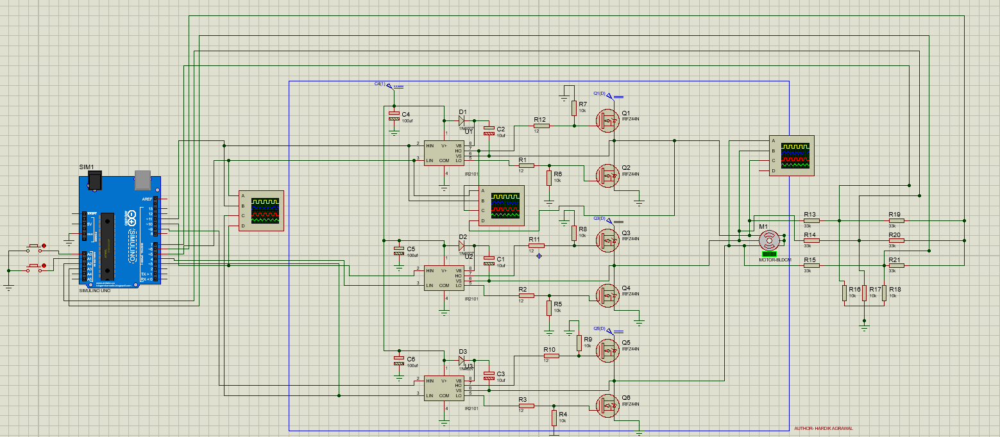

# Arduino Sensorless BLDC Motor Controller (ESC)

This project implements a **sensorless BLDC (Brushless DC) motor controller (ESC)** using an Arduino UNO. It drives a three-phase motor with MOSFET half-bridges (using IR2101 drivers), enabling adjustable speed control without Hall sensors—using back-EMF zero-crossing detection for commutation.

## Features

- Six-step (trapezoidal) commutation algorithm in C for Arduino.
- Sensorless operation using the built-in analog comparator for zero-crossing detection.
- Manual speed adjustment via push buttons (increase/decrease).
- PWM duty cycles mapped to high/low side MOSFET gates.

## Schematic
- Arduino UNO generates logic signals for all three phases.
- IR2101 MOSFET drivers for high/low-side switching.
- Three-phase BLDC motor, motor voltage supply, integrated pushbuttons for user speed control.
- Analog voltage dividers to feed back-EMF from unpowered phase into the Arduino for comparator-based commutation.

**Hardware required:**
- Arduino UNO (or compatible ATmega328P board)
- IR2101 gate drivers (x3)
- N-channel MOSFETs (x6, e.g., IRFZ44N)
- Sensorless BLDC motor (3-phase)
- Push buttons for SPEED UP / SPEED DOWN

